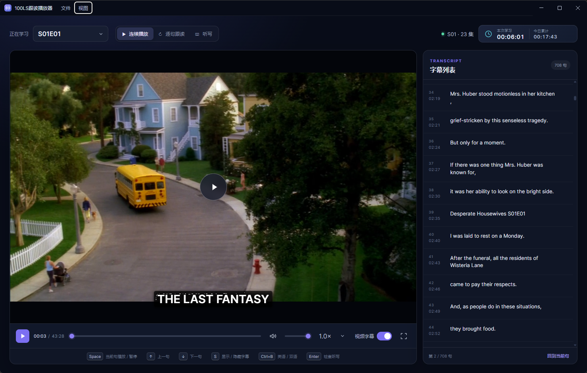

<p align="center">
  
</p>

<h1 align="center">100LS跟读播放器</h1>

<p align="center">
  一个面向本地视频和 SRT 字幕的英语听力、逐句跟读与听写播放器。<br />
  免注册、无后端、本地优先。
</p>

<p align="center">
  <a href="../../releases/latest"><strong>下载最新版</strong></a>
  ·
  <a href="#使用方法">使用方法</a>
  ·
  <a href="#开发与构建">开发构建</a>
</p>



> 截图中的视频和字幕仅用于展示播放效果，不包含在软件与仓库中。

## 它能做什么

- 打开一个视频或整个视频文件夹，自动匹配同名 SRT 字幕。
- 左侧播放视频，右侧同步显示字幕列表；也可一键隐藏右侧面板。
- 支持英文字幕和中英双语字幕切换。
- 支持连续播放、逐句跟读和听写三种学习模式。
- 点击字幕单词即可查看本地释义、词形还原和音标。
- 记录本次学习时长与当日累计时长，数据只保存在本机。
- 支持拖入视频、字幕或整个目录。
- 保留最近打开记录，但启动时不会擅自载入上次的视频。
- Windows 版内置 FFmpeg，MKV/AVI 首次打开时会自动无损换封装为播放缓存，不会修改原视频。

## 下载 Windows 版

请在项目的 [Releases](../../releases/latest) 页面下载：

| 文件 | 适合场景 |
| --- | --- |
| `100LS跟读播放器-*-x64-安装版.exe` | 按向导安装，可创建桌面和开始菜单快捷方式 |
| `100LS跟读播放器-*-x64-便携版.exe` | 无需安装，下载后双击即可运行，也可拷贝到 U 盘 |

当前 Windows 发布包尚未进行代码签名，首次运行时可能看到“未知发布者”或 SmartScreen 提示。请只从本项目的 Releases 页面下载。

> 当前发布成品为 Windows x64 版。项目已保留 Electron/macOS 与 Web 适配层，其他平台的正式发布包将在后续完善。

## 使用方法

### 1. 准备视频和字幕

视频与字幕应放在同一个目录，并使用相同的基础文件名：

```text
S01E01.mkv
S01E01.eng.srt    # 英文字幕
S01E01.srt        # 中英双语字幕
```

目前支持 MKV、MP4、WebM、MOV、M4V、AVI 视频与 SRT 字幕。

### 2. 打开内容

- 直接把视频、SRT 字幕或文件夹拖进窗口。
- 使用 `文件 > 打开视频…`。
- 使用 `文件 > 打开视频文件夹…` 载入整季视频。
- 使用 `文件 > 最近打开` 重新载入最近使用的内容。

打开单个视频后，播放器会扫描它所在的文件夹、选中该视频，并自动匹配同名字幕。

### 3. 选择学习模式

| 模式 | 行为 |
| --- | --- |
| 连续播放 | 像普通播放器一样连续播放 |
| 逐句跟读 | 播放当前字幕句，到句尾自动暂停，等待跟读 |
| 听写 | 隐藏字幕答案，逐句播放，支持逐词输入和自动检查 |

## 常用快捷键

| 快捷键 | 功能 |
| --- | --- |
| `Space` | 播放或暂停；逐句模式下播放当前句 |
| `↑` | 播放上一句 |
| `↓` | 播放下一句 |
| `S` | 显示或隐藏视频上的字幕 |
| `Ctrl+B` | 切换英文／双语字幕 |
| `Ctrl+Shift+L` | 显示或隐藏右侧字幕列表 |
| `Enter` | 检查当前听写 |
| `Ctrl+O` | 打开单个视频 |
| `Ctrl+Shift+O` | 打开视频文件夹 |
| `F11` | 全屏显示整个窗口 |
| `Ctrl+Enter` | 视频区域全屏 |

## 听写模式

进入“听写”后，视频字幕和右侧字幕正文会被隐藏。播放器在当前句句尾自动暂停，并生成对应数量的单词输入框。

- 输入一个单词后按空格，跳到下一个输入框。
- 按回车键直接检查整句。
- 错误单词会标红，并在输入框下方显示正确答案。
- “重播本句”会保留已输入的内容。

## 字幕查词

在视频字幕或右侧字幕列表中点击英文单词，播放器会暂停并打开查词卡片。

- 释义和音标来自随应用发布的 ECDICT 静态词库，无需注册或后端服务。
- `seemed`、`apples`、`running` 等词形会尝试还原到基本形。
- 英音和美音按钮会尝试播放有道在线发音；网络不可用时降级到系统英文语音。
- 可选择打开有道原始页面查看完整释义，软件不抓取或缓存其网页内容。
- 听写模式下查词功能会自动禁用，避免提前显示答案。

## 本地与隐私

- 视频、字幕、听写内容不会上传到项目服务器。
- 学习时长和最近打开记录只保存在当前设备。
- 在线发音与“在有道查看”需要网络；其余核心播放和练习功能可本地使用。

## 作者与许可证

- 开发者：**duke cui**
- 联系邮箱：[cuitongliang@gmail.com](mailto:cuitongliang@gmail.com)
- 软件许可：[PolyForm Noncommercial License 1.0.0](LICENSE)

本项目源码允许用于个人学习、研究及其他非商业用途，也允许在非商业范围内修改和开发衍生软件。修改、分发或发布衍生软件时，必须同时保留本项目的许可协议和作者声明。

任何商业使用、收费分发、商业产品集成或商业服务，均须事先通过上述邮箱取得作者的书面授权。由于许可协议限制商业使用，本项目属于“源码公开、非商业使用许可”，并非 OSI 定义下的开源软件。

项目所使用的第三方组件继续适用各自的许可协议，详情见 [THIRD_PARTY_NOTICES.md](THIRD_PARTY_NOTICES.md)。

## 开发与构建

需要 Node.js 和 npm。

```powershell
npm install
npm run dev
```

仅运行 Web 版：

```powershell
npm run dev:web
```

运行测试和生产构建：

```powershell
npm test
npm run build
```

打包 Windows 安装版与便携版：

```powershell
npm run dist:win
```

成品会生成在 `release/` 目录。该目录不应提交到普通 Git 历史，请将 EXE 上传为 GitHub Release 附件。

如需重建本地 ECDICT 静态分片：

```powershell
npm run dictionary:build -- "D:\path\to\ecdict.csv"
```

## 工程结构

```text
electron/       Electron 窗口、原生菜单、目录扫描与 FFmpeg 处理
src/core/       与平台无关的文件匹配、字幕与学习规则
src/platform/   Electron 与 Web 本地文件适配层
src/app.js      共享播放器界面与学习流程
public/         图标、本地字典等静态资源
test/           自动化测试
```
